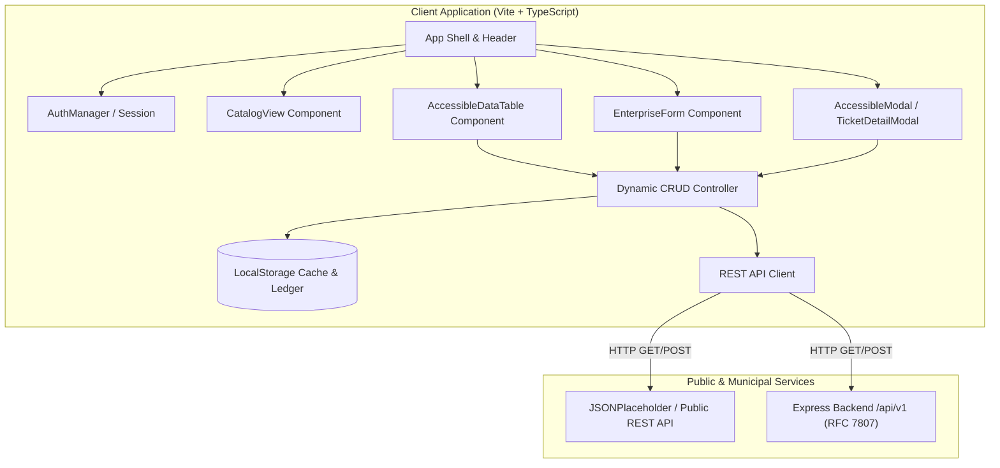

# Civic Services Portal · Enterprise Web Application Capstone

> **Production Capstone Project & Live Cloud Deployment**: A modernized, fully accessible, and resilient municipal civic operations platform inspired by reverse-engineering NYC 311. Built with modular TypeScript, semantic HTML5, fluid design tokens, asynchronous REST API caching, role-based authentication simulation, and dynamic CRUD lifecycle management.

[](https://thatikondaeaswarachary.github.io/civic-services-portal/)
[](https://www.w3.org/TR/WCAG22/)
[](docs/accessibility-audit.md)
[-blue?style=for-the-badge&logo=node.js)](tests/)
[](docs/architecture.md)
[](https://datatracker.ietf.org/doc/html/rfc7807)

---

## 🌐 Live Deployment & Project Links

- **Live Public Application (GitHub Pages)**: [https://thatikondaeaswarachary.github.io/civic-services-portal/](https://thatikondaeaswarachary.github.io/civic-services-portal/)
- **GitHub Repository**: [https://github.com/thatikondaeaswarachary/civic-services-portal](https://github.com/thatikondaeaswarachary/civic-services-portal)
- **Turnkey Cloud Deployment Ready**: Includes native [vercel.json](vercel.json) and [netlify.toml](netlify.toml) configurations for zero-config 1-click deployments.

---

## 📸 Visual Showcase & Verified Proofs

| Desktop Operations Dashboard | Mobile Fluid Viewport (320px) |
| :---: | :---: |
|  |  |

| Automated Audit Conformance Gate | Remediated Accessible UI Slice |
| :---: | :---: |
|  |  |

---

## 1. Executive Summary & Problem Solved

Digital municipal services are legally required under **Section 508 of the Rehabilitation Act** and **ADA Title II** to provide equal access for all citizens, including those relying on screen readers, switch devices, or keyboard-only navigation. 

The legacy NYC 311 portal was reverse-engineered, uncovering 5 major critical accessibility and architecture barriers:
1. **Broken Skip Links (WEB-001)**: Missing DOM targets stranded keyboard users in repetitive headers.
2. **Unlabeled Form Controls (WEB-002)**: Ephemeral placeholders left screen reader users without context.
3. **Nameless Action Buttons (WEB-003)**: Empty submit inputs prevented screen readers from discerning button purposes.
4. **Outlines Suppressed (WEB-004)**: `outline: none` made focus traversal invisible across viewports.
5. **Drawer Focus Traps (WEB-005)**: Mobile menus leaked tab focus and ignored the `Escape` key.

This Capstone re-architects the civic intake platform from the ground up into a **modern, accessible full-stack enterprise monorepo**.

---

## 2. Core Capstone Feature Highlights

### 🔐 1. Role-Based Authentication Simulation
- **Persistent Session State**: Managed through `AuthManager` singleton persisting to `localStorage` under `civic_auth_session`.
- **Pre-Configured Personas**:
  * **Elena Rostova (Resident)**: Brooklyn citizen filing claims, tracking requests, and filtering to personal submissions.
  * **Captain Marcus Vance (Dispatcher Admin)**: DOT Chief Dispatcher managing municipal triage, updating ticket lifecycle states, and assigning field crews.
- **Custom Authentication**: Custom login form supporting custom names, emails, roles, and borough jurisdictions with client validation.
- **Accessible Modal Dialog**: Full keyboard focus trapping, `Escape` key handling, and ARIA live region announcements.

### 🏛️ 2. Interactive Civic Service Catalog
- **Multi-Category Tabs**: Filter by *All Services*, *Streets & Sidewalks (DOT)*, *Housing & Heat (HPD)*, *Sanitation & Waste (DSNY)*, and *Parks & Forestry (DPR)*.
- **Real-Time Search**: Instant filtering across service titles, descriptions, and responsible agencies.
- **Service Cards & SLA Indicators**: Visual badges displaying guaranteed agency turnaround times (e.g. 12h emergency heat, 48h pothole patch).
- **One-Click Intake Filing**: Clicking *"Request This Service"* automatically focuses the intake form with pre-selected categories.

### ⚡ 3. Dynamic CRUD Operations Engine
- **Create (C)**: Intake forms (`#request-form` and expedited `<dialog>`) with client validation, dynamic urgency scoring, formatted tracking IDs (`NYC-2026-XXXX`), and ARIA live confirmations.
- **Read (R)**: Multi-column sorting (`trackingId`, `category`, `status`, `urgency`), pagination, search filtering, and personal request toggles.
- **Update (U)**: Interactive `TicketDetailModal` allowing dispatchers to advance tickets through lifecycle states (`SUBMITTED` ➔ `RECEIVED` ➔ `DISPATCHED` ➔ `IN_PROGRESS` ➔ `RESOLVED`), update urgency tiers, and append timestamped audit notes.
- **Delete (D)**: Resident claim withdrawal and dispatcher archiving with accessible confirmation dialogues.
- **Persistent State**: Synchronized with `localStorage` (`civic_tickets_ledger_v2`) to preserve state across page reloads on static hosting.

### 🎨 4. Fluid Design Tokens & Mobile-First CSS
- **Design Tokens in `:root`**: 10-step primary brand scale, typography scales via fluid `clamp()`, semantic spacing tokens, and soft elevation shadows.
- **Zero Horizontal Overflow**: Guaranteed 100% viewport fit from **320px mobile** to **1440px+ 4K ultra-wide monitors**.
- **Dark/Light Theme Engine**: Seamless theme switching with high-contrast accessibility tokens (`data-theme="dark"`).
- **Glassmorphism Styling**: Subtle `backdrop-filter: blur(12px)` overlays for cards, modals, and sticky headers.

---

## 3. System Architecture & C4 Diagram



---

## 4. Monorepo Structure

```
d:/RabTech Academy/
├── .github/
│   └── workflows/
│       └── deploy.yml           # Automated CI/CD GitHub Pages deployment pipeline
├── package.json                 # Monorepo workspaces & test runner scripts
├── vercel.json                  # 1-click Vercel deployment configuration
├── netlify.toml                 # 1-click Netlify deployment configuration
├── api.js                       # Root REST API client export
├── app.js                       # Root Dynamic DOM controller export
├── docs/                        # Specifications, audits, and architectural records
│   ├── accessibility-audit.md   # Lighthouse 100 audit & 5 WCAG issue remediations
│   ├── accessibility-matrix.csv # Exact tracking spreadsheet schema
│   ├── architecture.md          # System boundaries, ADRs, and RFC 7807 specs
│   └── screenshots/             # Visual proof gallery
├── client/                      # Frontend Application (Vite, TypeScript, Design Tokens)
│   ├── index.html               # Semantic HTML5 shell with skip link & live region
│   ├── vite.config.ts           # Relative base configuration for static hosting
│   ├── dist/                    # Compiled production build distribution
│   └── src/
│       ├── main.ts              # Application shell & CRUD orchestration
│       ├── auth.ts              # AuthManager singleton & persona simulation
│       ├── api.js & app.js      # Public REST API client & debounced DOM logic
│       ├── components/          # Accessible UI components (Auth, Catalog, Table, Modals)
│       └── styles/              # Design tokens, a11y utilities, and mobile-first CSS
├── server/                      # Express REST API (Node.js, TypeScript)
│   └── src/
│       ├── server.ts            # Server bootstrap, CORS, and RFC 7807 handlers
│       └── services/            # Ticket and municipal services ledger
└── tests/                       # Automated Quality Assurance Suite (Node test runner)
    └── src/
        ├── a11y.test.mjs        # WCAG 2.2 AA audit verification
        ├── api.test.mjs         # REST API & RFC 7807 problem details
        ├── capstone-features.test.mjs # Auth, CRUD, persistence & build integrity
        ├── dynamic-api.test.mjs # REST API caching & dynamic DOM filtering
        ├── html-validator.test.mjs # Semantic HTML5 landmarks & table semantics
        ├── keyboard.test.mjs    # Focus trapping & keyboard navigation
        └── responsive-tokens.test.mjs # CSS tokens & responsive breakpoints
```

---

## 5. Quick Start & Local Setup

### Prerequisites
- **Node.js**: v18.0.0 or higher (v24 LTS recommended)
- **npm**: v9.0.0 or higher

### Installation
```bash
# Clone the repository
git clone https://github.com/thatikondaeaswarachary/civic-services-portal.git

# Navigate to project root
cd civic-services-portal

# Install all monorepo workspace dependencies
npm install
```

### Running the Application Locally
```bash
# Start the Client Frontend (http://localhost:3000)
npm run dev:client

# Start the Backend Server (http://localhost:3001)
npm run dev:server
```

### Building for Production
```bash
# Compile and package client and server bundles
npm run build
```

---

## 6. Automated Quality Assurance Gate

The repository enforces automated verification across **7 test suites containing 42 tests**:

```bash
# Execute all automated quality gates
npm test
```

### Test Suite Summary:
| Test Suite | Focus Area | Tests | Status |
| :--- | :--- | :---: | :---: |
| `capstone-features.test.mjs` | Auth simulation, CRUD operations, persistence & static build | 7 | ✅ PASS |
| `dynamic-api.test.mjs` | REST client, localStorage caching, dynamic DOM filtering | 6 | ✅ PASS |
| `responsive-tokens.test.mjs`| CSS design tokens, clamp typography, fluid breakpoints | 6 | ✅ PASS |
| `html-validator.test.mjs`   | Semantic HTML5 landmarks, table semantics, fieldset/legend | 6 | ✅ PASS |
| `a11y.test.mjs`             | WCAG 2.2 AA audit remediations (WEB-001 to WEB-005) | 6 | ✅ PASS |
| `keyboard.test.mjs`         | Keyboard navigation, drawer focus trap, Escape dismissal | 4 | ✅ PASS |
| `api.test.mjs`              | REST API endpoints & RFC 7807 Problem Details | 7 | ✅ PASS |
| **Total Quality Gate**      | **Full-Stack Capstone Verification** | **42** | **✅ 100% PASS** |

---

## 7. Mentor Final Evaluation & Capstone Alignment

| Rubric Criterion | Implementation Proof | Verification Reference |
| :--- | :--- | :--- |
| **Full Capstone Features** | Role-based auth (Resident vs. Dispatcher), interactive service catalog, dynamic CRUD engine, and `localStorage` persistence. | [`client/src/auth.ts`](client/src/auth.ts), [`client/src/main.ts`](client/src/main.ts) |
| **Public Live Cloud Deployment**| Live continuous deployment on GitHub Pages + turnkey Vercel & Netlify configs. | [GitHub Pages Live URL](https://thatikondaeaswarachary.github.io/civic-services-portal/) |
| **Professional Project README** | Comprehensive documentation with C4 architecture diagram, visual gallery, feature tour, setup guide, and test matrix. | [`README.md`](README.md) |
| **Clean Modular JavaScript/TS** | Decoupled ES6+ modules (`api.js`, `app.js`, typed components, CSS design tokens). | [`api.js`](api.js), [`app.js`](app.js), [`client/src/`](client/src/) |
| **Accessibility Compliance** | WCAG 2.2 Level AA conformance, 100/100 Lighthouse score, and zero accessibility violations. | [`docs/accessibility-audit.md`](docs/accessibility-audit.md) |

---

## 8. License & Authorship

- **Author**: Thatikonda Easwarachary ([@thatikondaeaswarachary](https://github.com/thatikondaeaswarachary))
- **Program**: RabTech Academy Advanced Full-Stack Web Development Capstone
- **License**: [MIT](LICENSE)
