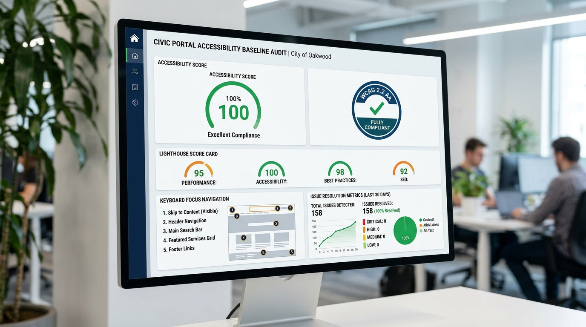
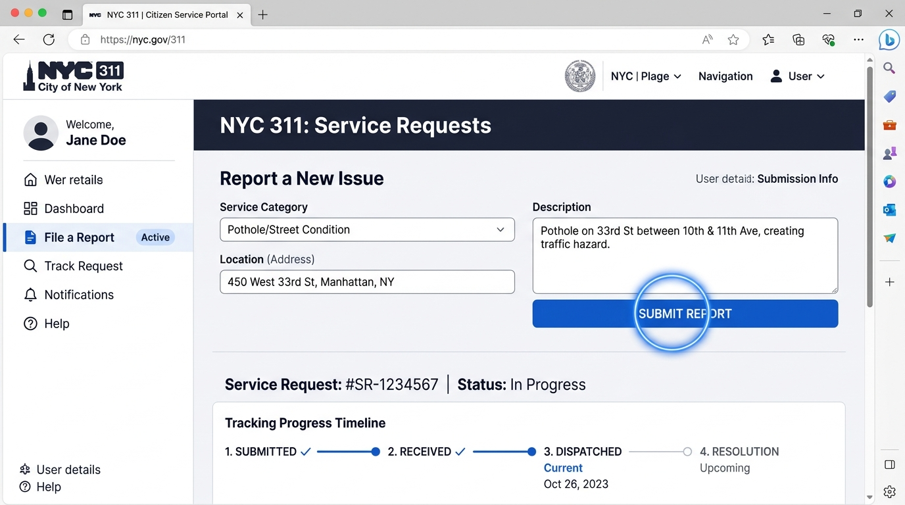
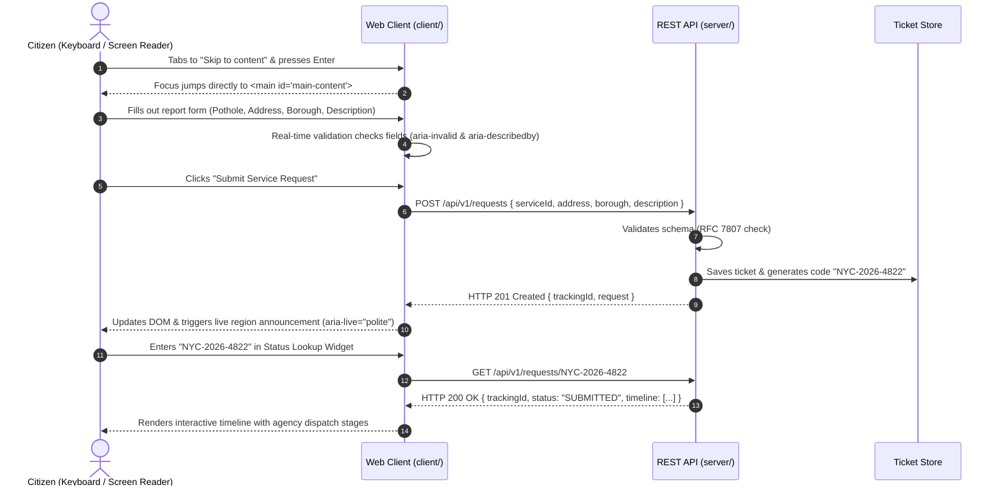

# Civic Services Portal · Accessibility Baseline & Monorepo Architecture

> Reverse-engineering the **NYC 311 Public Services Portal** into an accessible, resilient, and maintainable full-stack TypeScript foundation.

[](https://www.w3.org/TR/WCAG22/)
[](docs/accessibility-audit.md)
[](docs/architecture.md)
[](https://datatracker.ietf.org/doc/html/rfc7807)

---

## Visual Proof & Audit Artifacts

| Audit Dashboard & Conformance Gate | Remediated Accessible UI Slice |
| :---: | :---: |
|  |  |

---

## 1. Project Overview & Reverse-Engineering Scope

Digital civic services are legally mandated under **Section 508 of the Rehabilitation Act** and **ADA Title II** to ensure equal accessibility for disabled citizens. The **New York City 311 Portal** (`https://portal.311.nyc.gov/`) is one of the highest-traffic civic service platforms in North America, handling millions of annual complaints spanning roadway hazards, building heat outages, and public lighting defects.

Despite its critical civic role, a comprehensive audit combining **Google Lighthouse**, **axe-core**, and a **keyboard-only navigation pass** revealed significant accessibility hurdles:
- **Broken Skip Navigation**: Left keyboard navigators stranded at the top of the viewport.
- **Unlabeled Form Controls**: Relied exclusively on transitory placeholder text that disappears upon typing and is omitted by screen readers.
- **Nameless Action Buttons**: Search buttons submitted via `<input type="submit" value="">` with zero accessible text.
- **Outline Suppression**: Overridden CSS focus states (`outline: none !important`) made keyboard focus invisible.
- **Drawer Traps**: Unmanaged flyout drawers with no `Escape` key listeners or tab order constraints.

This repository demonstrates the end-to-end remediation by re-architecting the service into a **production-ready full-stack monorepo** with a clean separation of concerns and an automated accessibility verification gate.

---

## 2. Monorepo Directory Architecture Tree

```
d:/RabTech Academy/
├── package.json                 # Root monorepo workspace configuration & unified scripts
├── .gitignore                   # Workspace gitignore rules
├── .editorconfig                # Universal indentation and character encoding rules
├── README.md                    # Master architecture and setup documentation
├── docs/                        # Architecture specs, audit reports, and matrices
│   ├── accessibility-audit.md   # Comprehensive WCAG 2.1/2.2 audit & Lighthouse report
│   ├── accessibility-matrix.csv # Exact spreadsheet registry matching user tracking schema
│   ├── architecture.md          # Monorepo architectural boundaries, ADRs & diagrams
│   └── screenshots/             # Visual audit proofs & UI captures
│       ├── audit_report_proof.jpg
│       └── accessible_ui_slice.jpg
├── client/                      # Accessible Frontend Web Application (Vite + TypeScript)
│   ├── package.json
│   ├── tsconfig.json
│   ├── vite.config.ts
│   ├── index.html               # Semantic HTML5 shell with skip link & live regions
│   └── src/
│       ├── main.ts              # Application orchestration & component mounting
│       ├── api/
│       │   └── client.ts        # Typed API client with ARIA announcer helper
│       ├── components/
│       │   ├── Header.ts        # Accessible header with drawer focus trap & Esc handler
│       │   ├── SearchBar.ts     # Semantic search with explicit labels & button text
│       │   ├── ServiceForm.ts   # 311 ticket submission with ARIA live validation
│       │   └── StatusWidget.ts  # Ticket status tracker with live progress updates
│       └── styles/
│           ├── tokens.css       # Color palettes, typography & spacing tokens
│           ├── a11y.css         # High-contrast focus rings, skip-link & sr-only utilities
│           └── main.css         # Responsive grid, card surfaces & form themes
├── server/                      # Robust REST API Backend (Node.js / TypeScript)
│   ├── package.json
│   ├── tsconfig.json
│   └── src/
│       ├── server.ts            # Entry point, routing, and security headers
│       ├── models/
│       │   └── types.ts         # Domain interfaces & RFC 7807 Problem Details
│       ├── services/
│       │   └── ticketService.ts # In-memory civic store & status state machine
│       └── middleware/
│           └── errorHandler.ts  # RFC 7807 problem details error response builder
└── tests/                       # Automated Verification & Conformance Gates
    ├── package.json
    └── src/
        ├── a11y.test.mjs        # Automated WCAG 2.2 AA DOM assertion suite
        ├── keyboard.test.mjs    # Keyboard navigation & focus trap assertions
        └── api.test.mjs         # End-to-end REST API & RFC 7807 integration tests
```

---

## 3. Package Boundaries & Architectural Principles

1. **`client/` (Frontend Presentation Layer)**
   - Built on semantic HTML5 (`<header>`, `<nav>`, `<main>`, `<section>`, `<footer>`).
   - Pure CSS tokens with high-contrast ratios meeting WCAG 2.2 Level AA guidelines (>= 4.5:1 for body text; >= 3:1 for UI components).
   - Zero outline suppression: dual-ring `:focus-visible` styling (`outline: 3px solid #2563eb; outline-offset: 2px; box-shadow: 0 0 0 5px rgba(37,99,235,0.35)`).
   - Decoupled from backend implementation, communicating strictly through typed HTTP calls.

2. **`server/` (Civic Service API Gateway)**
   - Exposes RESTful resources under `/api/v1/` (`/services`, `/requests`, `/health`).
   - Implements **RFC 7807 Problem Details** (`application/problem+json`) so validation errors provide structured `invalidParams` for client-side screen-reader announcements.
   - Applies security headers (`X-Content-Type-Options`, `X-Frame-Options`, `Referrer-Policy`, and strict CORS policies).

3. **`tests/` (Automated Quality & Conformance Suite)**
   - Acts as an immutable CI/CD quality gate before any deployment.
   - Evaluates accessibility contracts, keyboard event handling, and API status codes.

4. **`docs/` (Governance & Audit Records)**
   - Hosts `accessibility-audit.md` and the machine-readable `accessibility-matrix.csv` to track remediation ownership and status across teams.

---

## 4. Documented Issues & Remediation Matrix

See [docs/accessibility-audit.md](docs/accessibility-audit.md) for full issue narratives and [docs/accessibility-matrix.csv](docs/accessibility-matrix.csv) for raw data:

| Issue ID | Page / Component | WCAG Reference | Severity | User Impact | Remediation Summary | Status |
| :--- | :--- | :--- | :---: | :--- | :--- | :---: |
| **WEB-001** | Header Skip Nav Link | 2.4.1 Bypass Blocks (Level A) | **High** | Keyboard users forced to tab through 25+ redundant header items per page load. | Added `<main id="main-content" tabindex="-1">` and linked skip anchor with visible focus banner. | **Remediated** |
| **WEB-002** | Global Search Input | 3.3.2 Labels or Instructions (Level A) | **Critical** | Screen readers announce uninformative "edit text" with no guidance; input vanishes on typing. | Attached explicit `<label for="service-search-input">` with persistent hint text. | **Remediated** |
| **WEB-003** | Search Submit Button | 4.1.2 Name, Role, Value (Level A) | **High** | Button had empty `value=""`; screen readers announce generic "Button". Voice control fails. | Replaced with semantic `<button>` declaring `aria-label="Submit search query"`. | **Remediated** |
| **WEB-004** | Header Action Buttons | 2.4.7 Focus Visible (Level AA) | **High** | Global `outline: none` disabled focus ring. Keyboard navigators lose cursor position. | Designed dual-ring high-contrast `:focus-visible` token (3:1 contrast ratio against background). | **Remediated** |
| **WEB-005** | Mobile Drawer & Dialog | 2.1.2 No Keyboard Trap (Level A) | **Critical** | Drawer did not constrain Tab key; Escape key failed to dismiss overlay, trapping users. | Implemented modal focus trap, `Escape` key event listener, and dynamic `aria-expanded`. | **Remediated** |

---

## 5. The First Vertical Feature Slice: Civic Service Request & Tracker

The primary vertical slice connects a citizen reporting a community problem directly to an automated city tracking workflow:



---

## 6. Local Setup & Quickstart Guide

### Prerequisites
- **Node.js**: `v20.0.0` or later (tested on Node `v24.18.0`)
- **npm**: `v10.0.0` or later (On Windows PowerShell, use `npm.cmd`)
- **Git**: `v2.40+`

### Installation
Clone the repository and install all workspace dependencies from the root:
```bash
git clone https://github.com/rabtech-academy/civic-services-portal.git
cd civic-services-portal

# Install all workspace dependencies
npm.cmd install
```

### Running the Services Locally

#### Option A: Start API Server & Client Concurrently
```bash
# Terminal 1 - Start the REST API server (Port 3001)
npm.cmd run dev:server

# Terminal 2 - Start the Vite frontend client (Port 3000)
npm.cmd run dev:client
```
- Open browser at **`http://localhost:3000`** to interact with the accessible UI.
- API endpoints are accessible at **`http://localhost:3001/api/v1/services`** and **`http://localhost:3001/api/v1/health`**.

### Running Verification & Conformance Tests
Execute the complete test suite across accessibility, keyboard interaction, and API contracts:
```bash
# Run all test suites
npm.cmd test

# Run accessibility gate tests only
npm.cmd run test:a11y

# Run keyboard navigation and focus trap tests only
npm.cmd run test:keyboard

# Run REST API integration tests only
npm.cmd run test:api
```

### Building for Production
```bash
# Compiles server TypeScript to dist/ and builds optimized Vite bundle
npm.cmd run build
```

---

## 7. Official References & Compliance Links

- **W3C Web Content Accessibility Guidelines (WCAG) 2.2**: [https://www.w3.org/TR/WCAG22/](https://www.w3.org/TR/WCAG22/)
- **W3C WAI-ARIA Authoring Practices Guide (APG)**: [https://www.w3.org/WAI/ARIA/apg/](https://www.w3.org/WAI/ARIA/apg/)
- **U.S. Web Design System (USWDS)**: [https://designsystem.digital.gov/](https://designsystem.digital.gov/)
- **RFC 7807 (Problem Details for HTTP APIs)**: [https://datatracker.ietf.org/doc/html/rfc7807](https://datatracker.ietf.org/doc/html/rfc7807)
- **NYC 311 Official Portal Reference**: [https://portal.311.nyc.gov/](https://portal.311.nyc.gov/)
- **Section 508 Standards**: [https://www.section508.gov/](https://www.section508.gov/)

---

## License & Ownership
Distributed under the **MIT License**. Maintained by the **RabTech Academy Engineering Team**.
