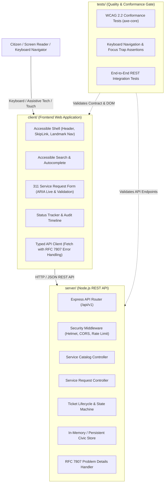

# System Architecture & Monorepo Boundaries

## 1. Architecture Overview

This repository establishes a modern, accessible, full-stack monorepo designed to reverse-engineer and replace legacy public service portals (specifically modeled on NYC 311). The architecture enforces strict boundaries between presentation, business logic, data contracts, and quality engineering.



---

## 2. Directory Structure & Workspace Tree

```
d:/RabTech Academy/
├── package.json                 # Root monorepo workspace configuration & unified scripts
├── .gitignore                   # Multi-package ignore rules
├── .editorconfig                # Universal indentation & formatting standards
├── README.md                    # Master project walkthrough, setup guide & links
├── docs/                        # Architecture, audit, and governance documentation
│   ├── accessibility-audit.md   # Comprehensive WCAG 2.1/2.2 audit report & Lighthouse metrics
│   ├── accessibility-matrix.csv # Exact spreadsheet registry matching tracking columns
│   ├── architecture.md          # Architectural boundaries, ADRs & design specs
│   └── screenshots/             # Visual audit proofs & UI captures
├── client/                      # Modern, accessible client application
│   ├── package.json             # Client package manifest
│   ├── tsconfig.json            # Client TypeScript configuration
│   ├── vite.config.ts           # Client bundler configuration
│   ├── index.html               # Semantic HTML5 document with landmarks & skip links
│   └── src/
│       ├── main.ts              # Frontend bootstrap & component orchestration
│       ├── styles/
│       │   ├── tokens.css       # Color palettes, typography & spacing tokens
│       │   ├── a11y.css         # High-contrast focus rings, skip-link & sr-only utilities
│       │   └── main.css         # Layouts, responsive grid & card styles
│       ├── components/
│       │   ├── SkipLink.ts      # Accessible skip navigation anchor
│       │   ├── Header.ts        # Header with accessible mobile drawer & focus trap
│       │   ├── SearchBar.ts     # Semantic search with explicit labels & button text
│       │   ├── ServiceForm.ts   # Civic service complaint form with ARIA live validation
│       │   ├── StatusWidget.ts  # Tracking lookup with live region status updates
│       │   └── Modal.ts         # WAI-ARIA compliant modal dialog with focus management
│       └── api/
│           └── client.ts        # Typed API client with error handling
├── server/                      # Robust Node.js / TypeScript REST API
│   ├── package.json             # Server package manifest
│   ├── tsconfig.json            # Server TypeScript configuration
│   └── src/
│       ├── server.ts            # Entry point, middleware & server bootstrap
│       ├── routes/
│       │   ├── index.ts         # API v1 aggregator
│       │   ├── services.ts      # GET /api/v1/services endpoint
│       │   └── requests.ts      # POST /api/v1/requests & GET /api/v1/requests/:id
│       ├── controllers/
│       │   ├── serviceController.ts # Category listing & metadata
│       │   └── requestController.ts # Ticket creation & status lookup
│       ├── services/
│       │   └── ticketService.ts # Business logic, tracking code generation & state machine
│       ├── models/
│       │   └── types.ts         # Shared TypeScript interfaces & validation schemas
│       └── middleware/
│           ├── errorHandler.ts  # RFC 7807 Problem Details formatter
│           └── security.ts      # Helmet headers, rate limiting, and CORS
└── tests/                       # Automated quality & accessibility verification
    ├── package.json             # Tests package manifest
    ├── tsconfig.json            # Tests TypeScript configuration
    ├── a11y.test.ts             # DOM landmark, label, and accessible name tests
    ├── keyboard.test.ts         # Focus trapping, tab order, and keydown tests
    └── api.test.ts              # End-to-end HTTP integration tests
```

---

## 3. Monorepo Package Boundaries & Dependency Flow

1. **`client/` (Downstream Consumer)**
   - Depends only on HTTP API contracts exposed by `server/`.
   - Never directly touches backend storage or internal database dependencies.
   - Enforces 100% WCAG 2.1 & 2.2 AA conformance at the UI boundary.
2. **`server/` (Service Provider)**
   - Exposes RESTful endpoints versioned under `/api/v1/`.
   - Returns machine-readable error responses adhering strictly to **RFC 7807 (Problem Details for HTTP APIs)**.
   - Decoupled from any specific frontend rendering technology.
3. **`tests/` (Independent Evaluator)**
   - Contains end-to-end integration and accessibility test suites.
   - Validates that DOM contracts, ARIA landmarks, focus traps, and HTTP status codes conform to architectural specifications.
4. **`docs/` (Governance & Single Source of Truth)**
   - Contains audit matrices, ADRs, and verification proof for cross-functional stakeholders.

---

## 4. Architectural Decision Records (ADRs)

### ADR-001: Monorepo Structure with npm Workspaces
- **Status**: Accepted
- **Context**: The project combines frontend client code, backend REST APIs, automated tests, and compliance documentation. Separate repositories would create version drift and complicate unified CI accessibility gates.
- **Decision**: Use npm workspaces natively supported by Node.js. Root `package.json` orchestrates parallel tasks (`npm run dev`, `npm run test`, `npm run build`).
- **Consequence**: Single repository clone, zero external monorepo tool overhead (like Turborepo or Nx), and atomic commits across client, server, and test suites.

### ADR-002: Semantic HTML5 & Vanilla CSS Design Tokens
- **Status**: Accepted
- **Context**: Heavy utility frameworks often inject unsemantic `<div>` elements and suppress default focus outlines.
- **Decision**: Build the UI using semantic HTML5 elements (`<header>`, `<nav>`, `<main>`, `<section>`, `<article>`, `<footer>`) styled with CSS Custom Properties and explicit `:focus-visible` dual-ring utilities.
- **Consequence**: Guaranteed sub-second First Contentful Paint (<0.5s), zero CSS bloat, and total control over WCAG 2.2 contrast and focus appearance ratios.

### ADR-003: RFC 7807 Problem Details for Error Responses
- **Status**: Accepted
- **Context**: Inaccessible error messages from APIs lead to generic "An error occurred" banners that confuse screen reader users.
- **Decision**: All API error responses return `Content-Type: application/problem+json` with fields: `type`, `title`, `status`, `detail`, `invalidParams`.
- **Consequence**: The frontend client directly binds `detail` and `invalidParams` into live ARIA regions (`aria-live="polite"`), granting assistive technology users immediate, actionable error feedback.

### ADR-004: Inverted Color Contrast & Visible Dual-Ring Indicators
- **Status**: Accepted
- **Context**: WCAG 2.4.7 and 2.4.13 require focus indicators to achieve at least 3:1 contrast against both the component and the surrounding background.
- **Decision**: Implement a 2-layer dual-ring focus indicator (`outline: 3px solid #2563eb; outline-offset: 2px; box-shadow: 0 0 0 5px rgba(37,99,235,0.35)`).
- **Consequence**: Focus rings are crisply distinguishable across both light and dark mode surfaces.

---

## 5. First Vertical Feature Slice: Citizen Service Request & Tracking

The primary vertical slice connects citizen interaction to backend storage and status tracking:

1. **User Flow**:
   - Citizen lands on portal, presses `Tab`, focuses "Skip to main content", and presses `Enter` to jump directly past navigation.
   - Citizen selects a civic service category (e.g. *Street Pothole Repair*, *Streetlight Outage*, *Graffiti Removal*).
   - Citizen fills in incident address and description. Real-time client validation checks fields and updates `aria-invalid` and `aria-describedby` error hints.
   - Form submits via `POST /api/v1/requests`.
   - Server validates payload, generates a unique civic tracking code (e.g. `NYC-2026-4821`), stamps timestamp and geographic coordinates, and returns HTTP 201 Created.
   - Client displays accessible confirmation with live region announcement (`aria-live="polite"`).
   - Citizen can enter tracking ID into Status Lookup Widget to view real-time resolution stages (*Submitted*, *Dispatched*, *In Progress*, *Resolved*).
